# Getting Started
{: .no_toc }

## Table of contents
{: .no_toc .text-delta }

1. TOC
{:toc}

---

## Modelagem de Dados

### Definição do modelo

#### Arquivo PMD

Os arquivos no formato **pmd** definem a base de dados, tendo informações referentes aos modelos em formato de classes com seus respectivos parâmetros. O atributo padrão é definido no pmd como PARM.  As classes podem ser definidas por MERGE_CLASS, sendo esta estática, enquanto as definidas por DEFINE_CLASS são classes dinâmicas. As definidas pelo MERGE_CLASS utilizam-se de duas ou mais classes na sua construção. Na figura 1 temos um exemplo da construção de um pmd.

Os parâmetros podem ser dos tipos: 

- DIMENSION: Representa a dimensão.
- DATE:  Representa o formato data.
- INTEGER: Representa um parâmetro definido por números inteiros.
- STRING: Representa um parâmetro definido por texto/caracteres.
- REAL: Representa um parâmetro definido por números reais.
- REFERENCE: Parâmetro que faz referência a outra classe já definida no mesmo PMD. 

Os parâmetros com o termo **@id** são utilizados como **identificadores**. Para todos os tipos é possível criar um vetor, contendo um número variado de dados deste mesmo tipo. Estes vetores podem ser indexados (**INDEX**) utilizando outros parâmetros.

`Figuras 1 e 2: Exemplo de estruturação de um arquivo pmd. No lado esquerdo temos um exemplo de definição de uma classe. Na direita, temos um exemplo de um parâmetro que faz referência a um parâmetro de outra classe.`

<div style="text-align:center">
    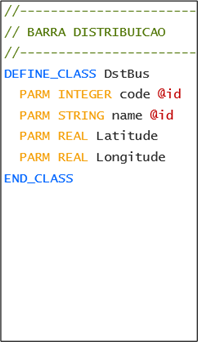
    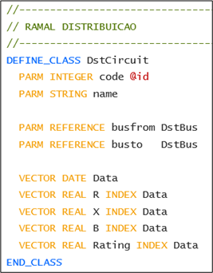
</div>

Quando o parâmetro possui o termo **DIM()** após a definição do seu tipo, é indicado a construção de colunas para esse parâmetro. O número de colunas irá seguir o tamanho do parâmetro utilizado dentro dos parênteses, geralmente sendo utilizado o parâmetro definido na mesma classe do tipo **DIMENSION**.    

#### Arquivo PMK

Os arquivos **pmk** são arquivos necessários para ser possível registrar e escrever o pmd documento com os dados alterados. Esta funcionalidade do PSRClasses gera automaticamente todos os formatos de arquivos necessários para representar as estruturas de dados contidas no(s) arquivo(s) pmd(s). Considerando a mesma classe do exemplo anterior, temos o exemplo de arquivo pmk.

`Figura 3: Exemplo de criação de um arquivo pmk a partir de um arquivo pmd.`

<div style="text-align:center">
    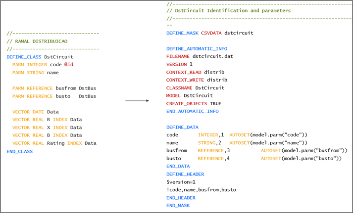
</div>

A criação de um arquivo pmk a partir do pmd é realizada de forma automática, sendo necessária apenas realizar alguns comandos no shell do Windows. 

```shell
$ gmask --path "path_do_pmd" -- context "Nome_do_modelo(sem espaço)"
```
```shell
$ qtemplate --path "path_do_pmd"
```

# Definição do layout das coleções na interface 

Os arquivos XML são utilizados para configuração da interface do MDStudio. A parte inicial dos nomes dos arquivos (representado por asterisco) pode ser alterada, porém a parte final do nome do arquivo deve manter o padrão listado abaixo. Estes arquivos XML são divididos em:

- *CollectionLayout.xml: Onde é definido quais atributos serão mostrados, quais são editáveis e de que forma são agrupados.

- *TreeView.xml: Onde é configurado a árvore de coleções para navegação do usuário.

- *LayoutDictionary.xml: Onde será configurado as traduções customizadas da interface, como grupos, navegação, nome customizável de tabela etc.

- *ExecutionTemplate.xml: Onde será configurado todos as execuções, scripts ou chamadas de outras aplicações da interface.

- *ToolsTemplate.xml: Onde será configurado os botões e grupos para as execuções na interface.

- LoadTemplate.xml: Único por aplicação onde define quais tipos de dados serão carregados.

## Layout inicial do caso

Os arquivos relacionados com a construção da visualização inicial do caso no MDStudio são os arquivos XML:

1.	*Treeview.xml
2.	*CollectionLayout.xml

O arquivo *TreeView.xml possui tags para realizar as separações necessárias para a divisão dos itens no formato de árvore e está localizado no lado esquerdo da interface (em laranja). Enquanto o arquivo *CollectionLayout.xml possui as informações para montar as seções do lado direito (em verde) referente a cada um desses itens (Figura 3).  

`Figura 4: Representação dos arquivos *Treeview.xml e *CollectionLayout.xml na interface.`

<div style="text-align:center">
    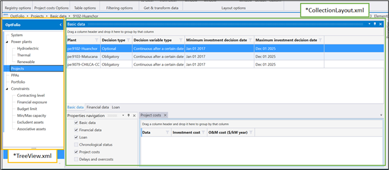
</div>

### *TreeView.xml

No arquivo *TreeView.xml é possível iniciar a construção da árvore utilizando a tag **TemplateGroup**, sendo apenas necessário apenas o preenchimento do atributo **Name**, geralmente se referindo ao nome do modelo utilizado. Para criar um item para esta árvore, é preciso adicionar a tag **TemplateCollection**, preenchendo os atributos como **Name** de acordo com os nomes das classes no arquivo pmd. Para alterar o nome que será mostrado, basta alterar o nome da coleção no arquivo *LayoutDictionary.xml. As instruções para esta alteração estão presentes na ~~seção XXX~~.

``Figura 5: Exemplo de configuração da árvore de visualização no arquivo xml.``

<div style="text-align:center">
    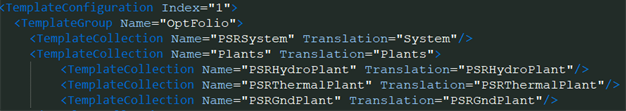
</div>

### *CollectionLayout.xml

No arquivo *CollectionLayout.xml, encontra-se outras divisões do layout, separadas em tags.

A tag **ElementCollection** é a primeira a ser definida. Ela se refere a cada coleção (ou classe), onde é possível também definir todas as suas características. Esta tag aparece na interface como visto na figura 3, equivalente ao mostrado como o *CollectionLayout.xml. Um exemplo do arquivo xml do uso do ElementCollection encontra-se na Figura 5. Esta tag pode conter várias flags, os essenciais são:
- **Name**: Representa o nome da coleção definida no PSRClasses ou a que foi definida no arquivo pmd;
- **Model**: Representa o modelo que será utilizado como base para a coleção;

Os parâmetros definidos no arquivo pmd serão definidos neste arquivo xml como **atributos** (Attribute). Os parâmetros atributos identificados com @id no arquivo pmd, são caracterizados como atributos identificadores, sendo definidos dentro da tag **InfoAttributes**. Todas as coleções precisam ter atributos identificadores.

``Figura 6: Exemplo de configuração da tag ElementCollection no arquivo xml.``

<div style="text-align:center">
    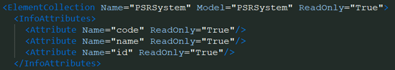
</div>

Dentro da tag ElementCollection é possível criar outras tags para definir como os atributos serão apresentados na interface. São divididas em (Figura 5):

1. GroupCollection: Onde é possível definir grupos para dividir os atributos em abas (em amarelo).

2. NavigationCollection: Onde será definido a estrutura de navegação das tabelas e grupos (em roxo);

3. Attributes: Onde serão definidos os parâmetros da coleção que foram previamente definidos no pmd (em vermelho);

4. TableAttributes: onde serão definidos os vetores e tabelas da coleção que foram previamente definidos no pmd (em azul);


``Figura 7: Representação das tags GroupCollection, NaviagationCollection, Attributes e TableAttributes na interface.``

<div style="text-align:center">
    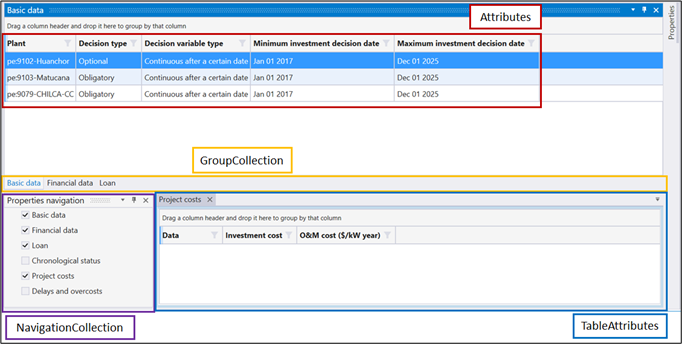
</div>

1. GroupCollection:
    O grupo usa a tag `<Group></Group>`, podendo definir quantos grupos quiser, respeitando códigos distintos (na mesma coleção). Com a principal função para dividir os atributos em diversos contextos por tipo de elemento. Os atributos que podem ser definidos na tag são:

    - Code: Representa a identificação única do grupo e usado para associar ao atributo;

    - IsHidden: Representa se o grupo inicializará escondido, caso seja igual a “True” ficará escondido, valor default é “False”;

    - Translation: Representa o nome da tradução desejada definida no xml de traduções (*LayoutDictionary.xml);

    ``Figura 8: Exemplo de configuração da tag GroupCollection no arquivo xml.``

    <div style="text-align:center">
        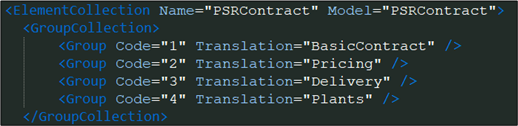
    </div>

2. NavigationCollection:
    A navegação vai organizar a visualização dos grupos, tabelas e dados cronológicos. A tag `<Navigation></Navigation>` usada para definir uma navegação. Exemplo da utilização do NavigationCollection é mostrado na Figura 8.

    - Name: Nome único de identificação para a navegação (por coleção).

    - Items: Definição de quais itens vão ser atrelados a esta navegação. Um item de navegação pode ser um grupo de atributos ou um atributo tabela, pode colocar N itens atrelados ao nó `<Navigation>`. A tag usada no item é `<NavigationItem></NavigationItem>`.

    - Name: Representa o Código do grupo desejado ou o nome do atributo tabela definido .

            Obs: Todas as tabelas caso não tenha dados seu nome fica em cinza claro.

    ``Figura 9: Exemplo de configuração da tag NavigationCollection no arquivo xml.``

    <div style="text-align:center">
        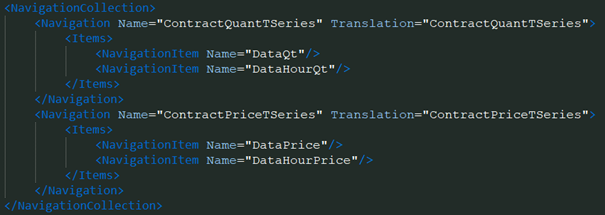
    </div>

3. Attributes:
    Os atributos padrões definidos no pmd (como PARM) serão definidos nesta tag. Cada um deles será mostrado na interface como uma coluna em seu determinado grupo e como um campo na tela de “Properties”. Mais informações sobre atributo serão dadas na ~~seção XXX~~.  Exemplo da utilização do Attributes é mostrado na Figura 9.

    ``Figura 10: Exemplo de configuração da tag Attributes no arquivo xml.``

    <div style="text-align:center">
        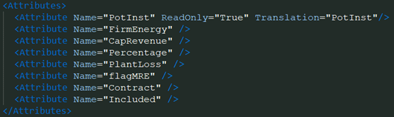
    </div>

    Se definido um grupo é possível utilizar a flag Group, para fazer referência ao grupo em que o atributo faz parte.

4. TableAttributes: 
    O modo de visualização de um parâmetro vetor é dado em forma de tabela. Existem alguns padrões como modificação (registros espaçados), dados em blocos de anos fechados (cronológicos), modificações com cadastro (data de 1900), etc. Os parâmetros do tipo dimensão também são visualizados através de uma tabela. O tipo de visualização das tabelas é dado pelo campo “IndexType”, dependendo do número, o atributo é montado na tela de forma diferente (respeitando o tipo do dado). Todos os atributos do tipo tabela devem ser definidos na tag `<TableAttributes>`. Mais informações sobre atributo serão dadas na ~~seção XXX~~. Exemplo da utilização do TableAttributes é mostrado na Figura 10.

    ``Figura 11: Exemplo de configuração da tag TableAttributes no arquivo xml.``

    <div style="text-align:center">
        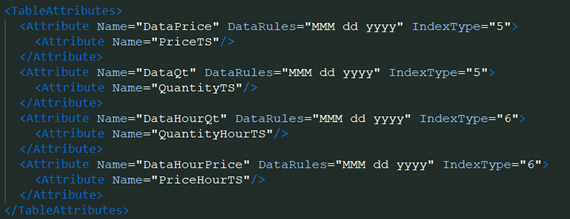
    </div>
